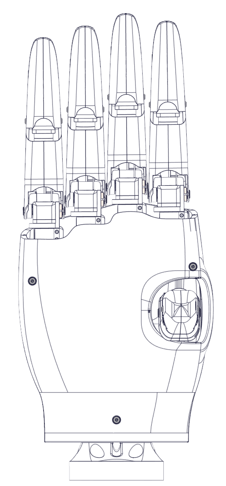
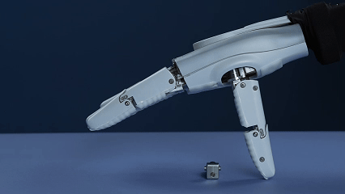
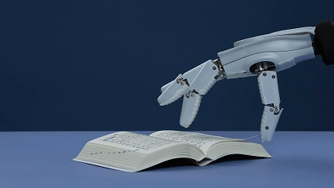
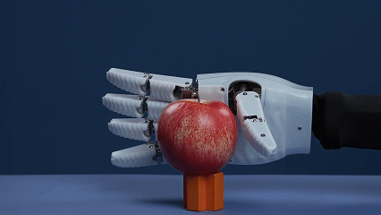
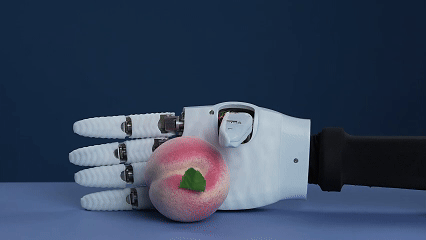

### **Project Title:**

  

**GaiaHand: An Open-Source Five-Fingered Dexterous Hand Based on Modular Joints**

### **Short Description:**

A high-performance, low-cost, and easily replicable five-fingered dexterous hand project featuring a modular joint design to empower robotics research and development.

  

### **Long Description:**

**GaiaHand** is an open-source, five-fingered dexterous hand project designed to provide robotics researchers, developers, and enthusiasts with a high-performance, low-cost, and easy-to-assemble hardware platform. We believe that a modular design philosophy can significantly reduce the design and maintenance costs of dexterous hands, accelerating iteration and innovation across various applications.

The core of this dexterous hand's design is its independently actuated joint modules. Each finger is constructed by connecting several of these modules in series, mimicking the degrees of freedom of a human hand. This approach not only simplifies the mechanical structure but also makes repairs and replacements exceptionally straightforward, simply swap out a faulty joint module without needing to disassemble the entire palm.

  

**Key Features:**

*   **Modular Design:** Based on independent, hot-swappable joint modules for easy assembly, customization, and maintenance.
*   **Highly Dexterous:** Equipped with multiple Degrees of Freedom (DoF) to emulate a wide range of complex human grasping and manipulation poses.
*   **Low-Cost Solution:** Utilizes off-the-shelf brushless motors and 3D-printed structural parts to significantly reduce manufacturing costs.
*   **Easy to Integrate:** Provides a standard UART communication interface for seamless integration into existing robotic systems.
*   **Fully Open-Source:** All hardware design files (CAD), electronics (PCB), and host computer software are open-sourced under the MIT License.
*   **Community Driven:** We welcome all forms of community contributions, whether it's code, design improvements, or sharing application use-cases.

**Technical Specifications (Example):**

*   **Degrees of Freedom (DoF):** 15 (3 DoF per finger)
*   **Joint Actuation:** High-performance BLDC motors with gear reducers
*   **Communication Interface:** Serial
*   **Software Support:** Python SDK, ROS/ROS2 (Coming soon)
*   **Structural Materials:** 3D Printed Parts (PLA+/PETG/ABS) + metal components

**Repository Contents:**

*   `/hardware`: Contains all 3D models (STEP, STL), schematics, and PCB design files (Gerber, Schematics).
*   `/firmware`: Firmware for the joint modules.
*   `/software`: Python SDK, control algorithm examples, and ROS/ROS2 packages (Coming soon).
*   `/docs`: Detailed assembly guides, Bill of Materials (BOM), and development documentation.

**Join Us:**

We enthusiastically welcome contributions of all kinds! Whether you are a hardware engineer, software developer, or robotics enthusiast, you can get involved in the following ways:

*   **Fork & Pull Request:** Submit your code or design improvements.
*   **Issue Tracker:** Report bugs or suggest new features.
*   **Discussions:** Share your building experiences and application showcases.

Let's build the next generation of high-performance, accessible dexterous hands together

**Grasp example:**

  

  

  

  

  

  

  

  

