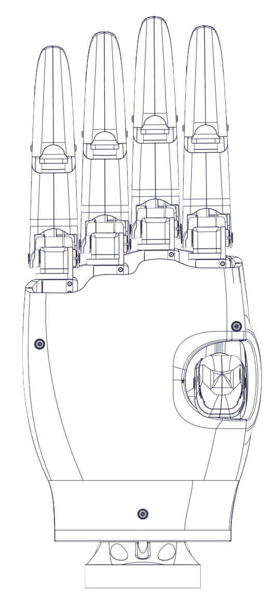
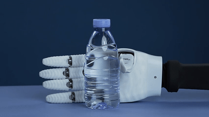
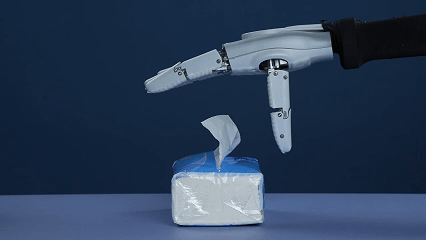
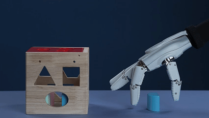
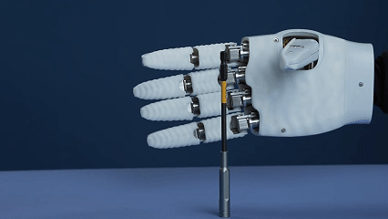
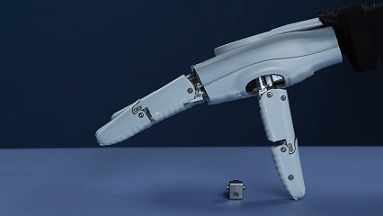
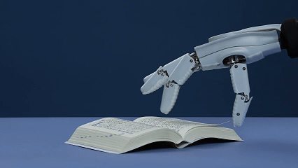
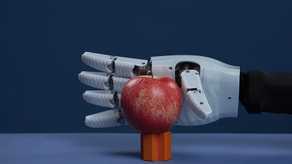
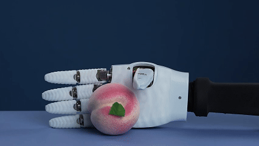

### 项目标题：

**GaiaHand: 一款基于模块化关节的开源五指灵巧手**

  

### 项目简介:

一个高性能、低成本、易于复现的五指灵巧手项目，采用模块化关节设计，助力机器人研究与开发。

  

### 描述:

**GaiaHand** 是一个开源的五指灵巧手项目，旨在为机器人研究人员、开发者和爱好者提供一个高性能、低成本且易于搭建的硬件平台。我们相信，通过模块化的设计理念，可以显著降低灵巧手的设计和维护成本，并加速其在不同应用场景下的迭代与创新。

该灵巧手的设计核心是可独立驱动的关节模组。每个手指由多个这样的模块串联而成，模拟人手的运动自由度。这种设计不仅简化了机械结构，也使得维修和替换变得异常轻松――您只需要更换故障的关节模块，而无需拆解整个手掌。

  

**主要特性:**

*   **模块化设计:** 基于独立的、可快速插拔的关节模组，易于组装、定制和维护。
*   **高度灵巧:** 具备多个自由度，能够模仿人手的各种复杂抓取和操作姿态。
*   **低成本方案:** 采用市面上常见的无刷电机和3D打印结构件，大幅降低了制造成本。
*   **易于集成:** 提供标准的UART通信接口，可以轻松集成到现有的机器人系统中。
*   **完全开源:** 所有硬件设计文件 (CAD)、电子电路 (PCB)、上位机软件均在 MIT许可下开源。
*   **社区驱动:** 我们欢迎来自社区的贡献，无论是代码、设计改进还是应用案例分享。

**技术规格 (示例):**

*   **自由度:** 15个 (每个手指3个自由度)
*   **关节驱动:** 高性能无刷直流电机 + 减速器
*   **通信接口:** Serial
*   **软件支持:** Python SDK，ROS/ROS2（尽情期待）
*   **结构材料:** 3D打印 (PLA+/PETG/ABS) + 金属件

**仓库内容:**

*   `/hardware`: 包含所有3D模型 (STEP, STL)、电路图和PCB设计文件 (Gerber,原理图)。
*   `/firmware`: 关节模组的固件。
*   `/software`: Python SDK以及控制算法示例、ROS/ROS2功能包（敬请期待）。
*   `/docs`: 详细的组装指南、BOM清单和开发文档。

**加入我们:**

我们热忱欢迎任何形式的贡献！无论您是硬件工程师、软件开发者还是机器人爱好者，都可以通过以下方式参与进来：

*   **Fork & Pull Request:** 提交您的代码或设计改进。
*   **Issue Tracker:** 报告BUG或提出新的功能建议。
*   **Discussions:** 分享您的制作经验和应用案例。 

让我们一起构建下一代高性能、易于普及的灵巧手！
**抓取示例：**

  

  

  

  

  

  

  

  

